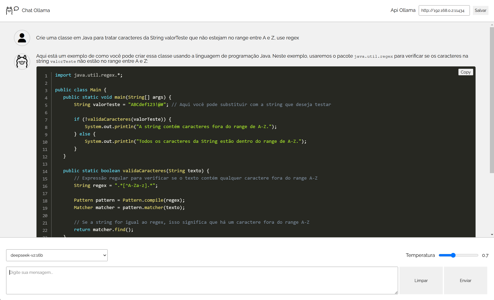

# Chat ollama

Projeto angular de chat com o [ollama](https://ollama.com/)




# Requisitos

|                 | Versão     |
| --------------- | ---------- |
| Angular CLI     | 19.1.2006  |
| Node            | 22.13.1    |
| Package Manager | npm 10.9.2 |
| nvm             | 0.40.1     |

# Start

## Angular

`npm start` ou `./run.sh`

- [http://localhost:4200/](http://localhost:4200/)

## Json server

`./server.sh`

- [http://localhost:3000/](http://localhost:3000/)

## Ollama

```bash
curl http://192.168.0.2:11434/api/generate -d '{
  "model": "deepseek-r1:7b",
  "prompt": "What color is the sky at different times of the day? Respond using JSON",
  "format": "json",
  "stream": false
}'
```

# Dependências

```bash
npm i ollama
npm i showdown --save
npm i --save-dev @types/showdown
npm i -g json-server
```

## TODO

- [x] Implementar o chat inicial
- [x] Consular a Api do Ollama
- [x] Formatar o markdown de retorno
- [x] Adicionar botão para copiar o código
- [ ] Explorar a Api de consulta para o Ollama
- [ ] Melhorar as mensagens
- [ ] Adicionar os estilos para as seções de código (resposta Ollama)


# Referências

- [Ollama JavaScript Library](https://github.com/ollama/ollama-js)
- [Fonte Awesome](https://fontawesome.com/icons)
- [Fonte Awesome cdn](https://cdnjs.com/libraries/font-awesome)
- [https://www.npmjs.com/package/json-server](https://www.npmjs.com/package/json-server)
- [loading editor](https://loading.io/#editor)
