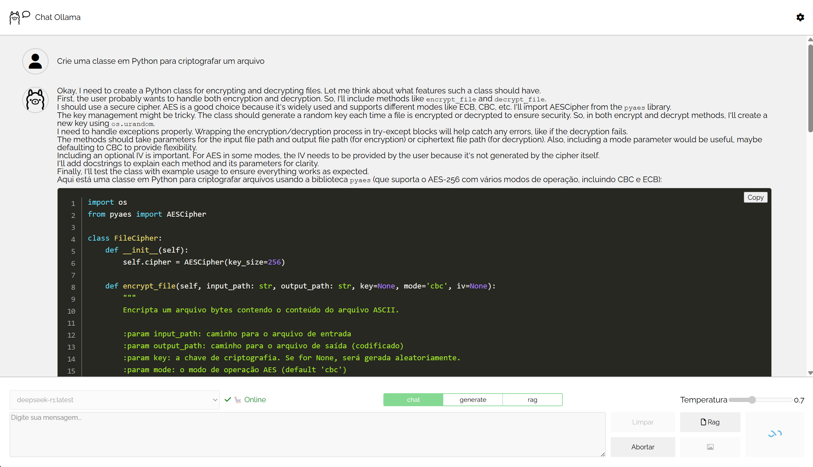

#  Chat ollama

Projetos [chat ollama](https://github.com/surfx/chat-ollama-angular/tree/master/chat-ollama-angular) e `RagAnalise`



# Configuração

## 1. C++ (Windows)

Instale o [vs_BuildTools.exe](https://visualstudio.microsoft.com/pt-br/visual-cpp-build-tools/)

## 2. Ollama (WSL)

[Ollama download](https://ollama.com/download)

```bash
curl -fsSL https://ollama.com/install.sh | sh
ollama serve
```

### 2.1 Modelos de interesse

Altere conforme necessidade

```bash
ollama pull gemma3:27b
ollama pull deepseek-r1:32b
ollama pull llama3.2:3b
ollama pull nomic-embed-text
ollama pull llama3.2-vision:11b
```

## 3. Uv (Windows)

[uv](https://docs.astral.sh/uv/getting-started/installation/)

```pwsh
powershell -ExecutionPolicy ByPass -c "irm https://astral.sh/uv/install.ps1 | iex"
uv python install 3.12.9
cd E:\programas\ia\virtual_environment
uv venv --python 3.12.9 my_env_3129
my_env_3129\Scripts\activate
uv pip install torch torchvision torchaudio --index-url https://download.pytorch.org/whl/cu126
uv pip install -U ipykernel tqdm numpy sympy chromadb protobuf==3.20.3 docling
uv pip install -U unstructured langchain langchain-community langchain_ollama langchain_chroma "unstructured[all-docs]" ipywidgets
uv pip install -U pytesseract flask flask-cors
```

Linux: `uv pip install -U tesserocr`

## 4. tesserocr (Windows)

O `tesserocr` é utilizado para fazer o OCR das imagens e posterior indexação no [Faiss](https://ai.meta.com/tools/faiss/)

- [tesserocr-windows_build](https://github.com/simonflueckiger/tesserocr-windows_build)
- [tesserocr-windows_build releases](https://github.com/simonflueckiger/tesserocr-windows_build/releases)

```bash
cd E:\programas\ia\virtual_environment
my_env_3129\Scripts\activate
uv pip install https://github.com/simonflueckiger/tesserocr-windows_build/releases/download/tesserocr-v2.8.0-tesseract-5.5.0/tesserocr-2.8.0-cp312-cp312-win_amd64.whl
```

### 4.1 tesseract releases

[tesseract releases](https://github.com/tesseract-ocr/tesseract/releases)

descompactar e adicione ao PATH do Windows: `E:\programas\ia\Tesseract-OCR\tessdata`

### 4.2 tessdata

[tessdata github](https://github.com/tesseract-ocr/tessdata)

Faça o download de [tessdata](https://github.com/tesseract-ocr/tessdata/archive/refs/heads/main.zip) e descompacte em: `E:\programas\ia\Tesseract-OCR\tessdata`

Adicione ao Windows PATH:

- TESSDATA_PREFIX : E:\programas\ia\Tesseract-OCR\tessdata

Para o Linux: `export TESSDATA_PREFIX=/usr/share/tesseract-ocr/4.00/tessdata`

# Iniciar

```bash
./run.sh
```

| Serviço       | URL Local                           | Descrição               |
|:-------------:|-------------------------------------|:------------------------|
| 🅰️ Angular    | [http://localhost:4200/](http://localhost:4200/) | Frontend web            |
| 🐍 Flask      | [http://127.0.0.1:5000/](http://127.0.0.1:5000/) | Backend API             |
| 🤖 Ollama     | [http://localhost:11434](http://localhost:11434) | Modelos de LLM          |

# Informações

Para mais informações, veja:

- [chat ollama](https://github.com/surfx/chat-ollama-angular/tree/master/chat-ollama-angular)
- [RagAnalise](https://github.com/surfx/chat-ollama-angular/tree/master/RagAnalise)
