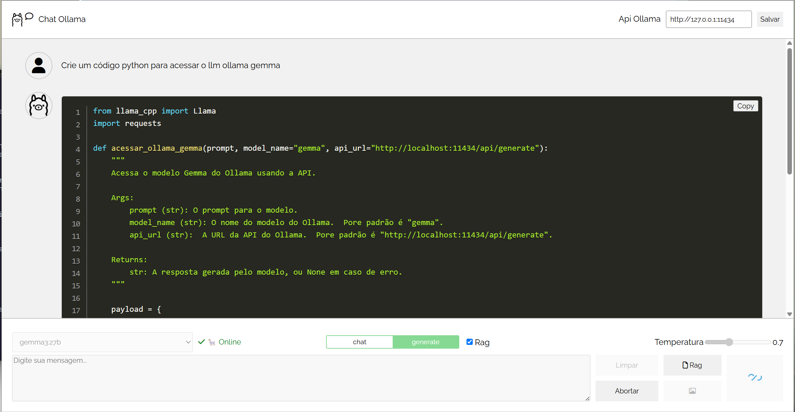

#  Chat ollama

Projeto angular de chat com o [ollama](https://ollama.com/)



## Índice

-  [Chat ollama](#chat-ollama)
- 🤖 [Requisitos](#requisitos)
- 🏃‍♂️‍➡️ [Start](#start)
  - 🚀 [Angular](#angular)
  - 🪄 [Json server](#json-server)
  - 🦙 [Ollama](#ollama)
- 🤖 [Dependências](#dependências)
- 📄 [TODO](#todo)
- 🔗 [Referências](#referências)


|                 | Versão     |
| --------------- | ---------- |
| Angular CLI     | 19.1.2006  |
| Node            | 22.13.1    |
| Package Manager | npm 10.9.2 |
| nvm             | 0.40.1     |
| ollama          | 0.5.7      |


# 🏃‍♂️‍➡️ Start

## 🚀 Angular

`npm start` ou `./run.sh`

- [http://localhost:4200/](http://localhost:4200/)

## 🪄 Json server

`./server.sh`

- [http://localhost:3000/](http://localhost:3000/)

## 🦙 Ollama

Instale o [ollama](https://ollama.com/download) e os modelos. 

Configurar o path dos modelos (Windows):

```bash
setx OLLAMA_MODELS "E:\programas\ia\ollama"
```

Configurar o ollama na rede local (Windows):

```bash
setx OLLAMA_HOST "0.0.0.0"
```

No Linux altere o arquivo `.bashrc` ou `.zshrc`, etc.

Para instalar, p.ex., o modelo [deepseek-r1:7b](https://ollama.com/library/deepseek-r1), execute o seguinte comando:

```bash
ollama run deepseek-r1:7b
```


Exemplo de consulta via `curl`:

```bash
curl http://localhost:11434/api/generate -d '{
  "model": "deepseek-r1:7b",
  "prompt": "What color is the sky at different times of the day? Respond using JSON",
  "format": "json",
  "stream": false
}'
```


# 🤖 Dependências

```bash
npm i ollama
npm i showdown --save
npm i --save-dev @types/showdown
npm i -g json-server
npm i ngx-markdown
npm i prismjs
```

## 📄 TODO

- [x] Implementar o chat inicial
- [x] Consular a Api do Ollama
- [x] Formatar o markdown de retorno
- [ ] Melhorar as mensagens
- [x] Adicionar os estilos para as seções de código (resposta Ollama)
- [ ] Explorar a Api de consulta para o Ollama
- [ ] Adicionar botão para copiar o código

# 🔗 Referências

- [Ollama JavaScript Library](https://github.com/ollama/ollama-js)
- [Ollama deepseek-r1](https://ollama.com/library/deepseek-r1)
- [Fonte Awesome](https://fontawesome.com/icons)
- [Fonte Awesome cdn](https://cdnjs.com/libraries/font-awesome)
- [json-server](https://www.npmjs.com/package/json-server)
- [loading editor](https://loading.io/#editor)
- [Table to Markdown](https://tabletomarkdown.com/convert-spreadsheet-to-markdown/)
- [ngx-markdown](https://www.npmjs.com/package/ngx-markdown)
