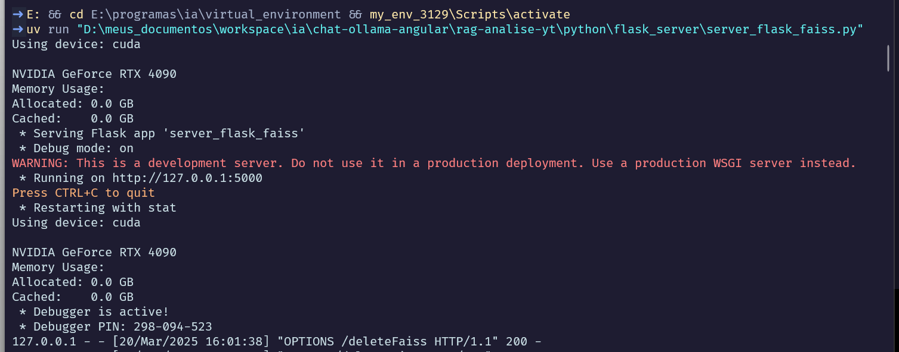

# RAG python FLASK

Este projeto sobe um servidor Python Flask para indexar arquivos com [Docling](https://github.com/docling-project/docling)
em uma base de dados vetorial [Faiss](https://ai.meta.com/tools/faiss/) para posterior consulta RAG com LLMs servidos
pelo [Ollama](https://ollama.com/).

O servidor Flask executa no endereço [http://127.0.0.1:5000](http://127.0.0.1:5000), arquivo `rag_python_faiss.py`

Exemplo de indexação curl: 
- `curl -X POST -H "Content-Type: text/plain" -d "D:\meus_documentos\workspace\ia\chat-ollama-angular\data" http://127.0.0.1:5000/indexarFaissdb`

Para mais informações veja a seção `Curls` > `Indexar`.

## Consulta

Uma consulta de exemplo pode ser feito através de:

`curl "http://127.0.0.1:5000/doQuestion?prompt=Como+jogar+monopoly+%3F"`

Saída:


## Versões

|        | Versão |
| ------ | ------ |
| Python | 3.12.9 |
| Ollama | 0.6.0  |

## Modelos ollama

| NAME                    | ID           | SIZE   |
| ----------------------- | ------------ | ------ |
| gemma3:27b              | 30ddded7fba6 | 17 GB  |
| deepseek-r1:latest      | 0a8c26691023 | 4.7 GB |
| llama3.2:latest         | a80c4f17acd5 | 2.0 GB |
| nomic-embed-text:latest | 0a109f422b47 | 274 MB |


# Dependências

## Python pip

Como instalar o `pip`

```bash
curl -o get-pip.py https://bootstrap.pypa.io/get-pip.py
python get-pip.py
```

## C++

Instale o [vs_BuildTools.exe](https://visualstudio.microsoft.com/pt-br/visual-cpp-build-tools/)

## uv

[uv](https://docs.astral.sh/uv/) é um gerenciador de pacotes para Python. Utilizado para criar o ambiente virual.

Este foi configurado para uma pasta diferente do projeto (E:\programas\ia\virtual_environment), neste caso para o notebook encontrar o venv (vscode) aponte para: `"E:\programas\ia\virtual_environment\my_env_3129\Scripts\python.exe"`

```bash
powershell -ExecutionPolicy ByPass -c "irm https://astral.sh/uv/install.ps1 | iex"
uv python install 3.12.9
cd E:\programas\ia\virtual_environment
uv venv --python 3.12.9 my_env_3129
my_env_3129\Scripts\activate
uv pip install torch torchvision torchaudio --index-url https://download.pytorch.org/whl/cu126
uv pip install -U ipykernel tqdm numpy sympy chromadb protobuf==3.20.3 docling
uv pip install -U unstructured langchain langchain-community langchain_ollama langchain_chroma "unstructured[all-docs]" ipywidgets
uv pip install -U pytesseract flask flask-cors
```

**obs**: o comando para instalar o torch varia de acordo com o seu hardware e SO. Para mais informações veja [pytorch](https://pytorch.org/get-started/locally/).

Para o windows CUDA 12 foi usado: `uv pip install torch torchvision torchaudio --index-url https://download.pytorch.org/whl/cu126`

### link simbolico (opcional)

No cmd execute ([mklink](https://learn.microsoft.com/pt-br/windows-server/administration/windows-commands/mklink)):

```bash
MKLINK /D D:\meus_documentos\workspace\ia\rag\rag002\my_env_3129 E:\programas\ia\virtual_environment\my_env_3129
```

Sendo `D:\meus_documentos\workspace\ia\rag\rag002\my_env_3129` o path do projeto e `E:\programas\ia\virtual_environment\my_env_3129` o path do ambiente virtual criado com o [uv](https://docs.astral.sh/uv/). 

Obs<sup>1</sup>: execute o `mklink` no cmd e não no powershell.

Obs<sup>2</sup>: talvez precise habilitar o `mklink` no Windows.


## tesserocr

O `tesserocr` é utilizado para fazer o OCR das imagens e posterior indexação no [Faiss](https://ai.meta.com/tools/faiss/)

- [tesserocr-windows_build](https://github.com/simonflueckiger/tesserocr-windows_build)
- [tesserocr-windows_build releases](https://github.com/simonflueckiger/tesserocr-windows_build/releases)

```bash
cd E:\programas\ia\virtual_environment
my_env_3129\Scripts\activate
uv pip install https://github.com/simonflueckiger/tesserocr-windows_build/releases/download/tesserocr-v2.8.0-tesseract-5.5.0/tesserocr-2.8.0-cp312-cp312-win_amd64.whl
```

### tesseract releases

[tesseract releases](https://github.com/tesseract-ocr/tesseract/releases)

descompactar e adicione ao PATH do Windows: `E:\programas\ia\Tesseract-OCR\tessdata`

### tessdata

[tessdata github](https://github.com/tesseract-ocr/tessdata)

Faça o download de [tessdata](https://github.com/tesseract-ocr/tessdata/archive/refs/heads/main.zip) e descompacte em: `E:\programas\ia\Tesseract-OCR\tessdata`

Adicione ao Windows PATH:

- TESSDATA_PREFIX : E:\programas\ia\Tesseract-OCR\tessdata


## ~~Chromadb~~

~~Como servidor~~

- ~~[http://localhost:8000/](http://localhost:8000/)~~

~~chroma run --host localhost --port 8000 --path ./my_chroma_data~~


~~Atualmente o projeto salva os dados diretamente no disco com:~~

~~`chromadb.PersistentClient(path=persist_directory, settings=Settings(allow_reset=True))`~~

~~Para mais informações veja o arquivo: `rag_python_faiss.py`~~

## Ollama

```bash
curl -fsSL https://ollama.com/install.sh | sh
ollama serve
```

```bash
ollama pull gemma3:27b
ollama pull deepseek-r1:32b
ollama pull llama3.2:3b
ollama pull nomic-embed-text
```

Após a instalação do Ollama, execute com: `ollama serve`


Com o Ollama executando, instale os modelos com pull (ou run para instalar e testar). Em um novo shell: `ollama run deepseek-r1`

# Flask Rag

Para subir um servidor flask, execute o arquivo `rag_python_faiss.py`

```bash
cd E:\programas\ia\virtual_environment && my_env_3129\Scripts\activate
uv run D:\meus_documentos\workspace\ia\chat-ollama-angular\rag-analise-yt\python\rag_python_faiss.py
```



Obs: precisa do servidor ollama executando `ollama serve`


## Curls

As indexações, consultas e demais ações são feitas através do servidor flask [http://127.0.0.1:5000](http://127.0.0.1:5000).

Obs<sup>1</sup>: precisa do servidor ollama executando `ollama serve`

Obs<sup>2</sup>: verifique os PATHS e configurações específicas do seu SO

### Indexar

Para indexar os arquivos no [Faiss](https://ai.meta.com/tools/faiss/):

| Variável | Valor                                                          |
| -------- | -------------------------------------------------------------- |
| Pasta    | D:\\meus_documentos\\workspace\\ia\\chat-ollama-angular\\data  |

`curl -X POST -H "Content-Type: text/plain" -d "D:\meus_documentos\workspace\ia\chat-ollama-angular\data" http://127.0.0.1:5000/indexarFaissdb`

Todos arquivos que estiverem no diretório (e subdiretórios) informado serão indexados no [Faiss](https://ai.meta.com/tools/faiss/) na pasta: 

- `persist_directory = r"D:\meus_documentos\workspace\ia\chat-ollama-angular\db\faiss_db"`

Para alterar essa pasta, modifique o arquivo `rag_python_faiss.py`

### Consulta RAG

Exemplo de consulta RAG:

`curl "http://127.0.0.1:5000/doQuestion?prompt=Como+jogar+monopoly+%3F"`


Para o exemplo, previamente indexei um arquivo pdf com informações sobre o jogo Monopoly.

A resposta segue o padrão readme dos modelos de llm.

### Delete Faiss

Excluir Faiss db:

`curl -X DELETE "http://127.0.0.1:5000/deleteFaiss"`

# Notebooks

Os notebooks ipynb `notebook001.ipynb`, `notebook002.ipynb` e `notebook003.ipynb` servem de base para estudo, referência, melhora e testes dos métodos do arquivo `rag_python_faiss.py`, utilizando o Chromadb.

Devido ao tamanho dos arquivos gerados pelo Chromadb, falha nos métodos de `delete_collection` e `reset`, optou-se pelo uso do banco de dados vetorial [Faiss](https://ai.meta.com/tools/faiss/). Os notebooks ipynb `faiss001.ipynb`, `faiss002.ipynb` e `faiss003.ipynb` servem de base para estudo e referência.

# TODO

- [ ] utilizar o `tesserocr` para fazer o OCR das imagens dos PDFs
- [x] Integrar o servidor Flask RAG com o projeto [chat ollama angular](https://github.com/surfx/chat-ollama-angular).
- [ ] Alterar o projeto [rag-analise-yt](https://github.com/surfx/rag-analise-yt) na indexação - receber um conjunto de arquivos via POST
- [x] Criar GET para is alive
- [ ] Parametrizar o serviço

# Créditos

Quero agradecer à [Tony Kipkemboi](https://www.youtube.com/@tonykipkemboi) e seu vídeo [How to chat with your PDFs using local Large Language Models [Ollama RAG]](https://www.youtube.com/watch?v=ztBJqzBU5kc&t=352s), pelo seu entusiasmo e por partilhar seu conhecimento. Um vídeo simples sem utilizar apis pagas que motivaram o estudo e desenvolvimento deste projeto.

# Referências

- [How to chat with your PDFs using local Large Language Models [Ollama RAG]](https://www.youtube.com/watch?v=ztBJqzBU5kc)
- [Chat with PDF locally using Ollama + LangChain](https://github.com/tonykipkemboi/ollama_pdf_rag/tree/main)
- [nomic-embed-text](https://ollama.com/library/nomic-embed-text)
- [llama3.2](https://ollama.com/library/llama3.2)
- [deepseek-r1](https://ollama.com/library/deepseek-r1)
- [pytorch](https://pytorch.org/get-started/locally/)
- [Ollama](https://ollama.com/)
- [Ollama Embeddings](https://docs.llamaindex.ai/en/stable/examples/embeddings/ollama_embedding/)
- [Chroma Persistent Client](https://docs.trychroma.com/docs/run-chroma/persistent-client)
- [tesseract releases](https://github.com/tesseract-ocr/tesseract/releases)
- [gemma3:27b](https://ollama.com/library/gemma3:27b)
- [uv](https://docs.astral.sh/uv/)
- [chat ollama angular](https://github.com/surfx/chat-ollama-angular)
- [Docling](https://github.com/docling-project/docling)
- [Faiss](https://ai.meta.com/tools/faiss/)
